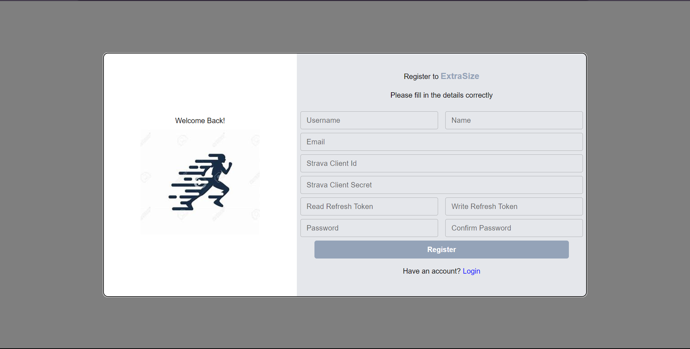
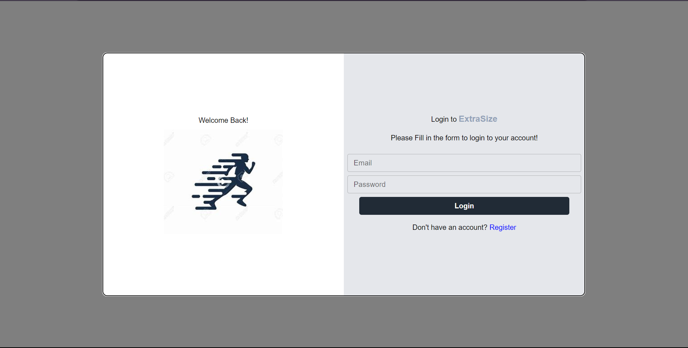
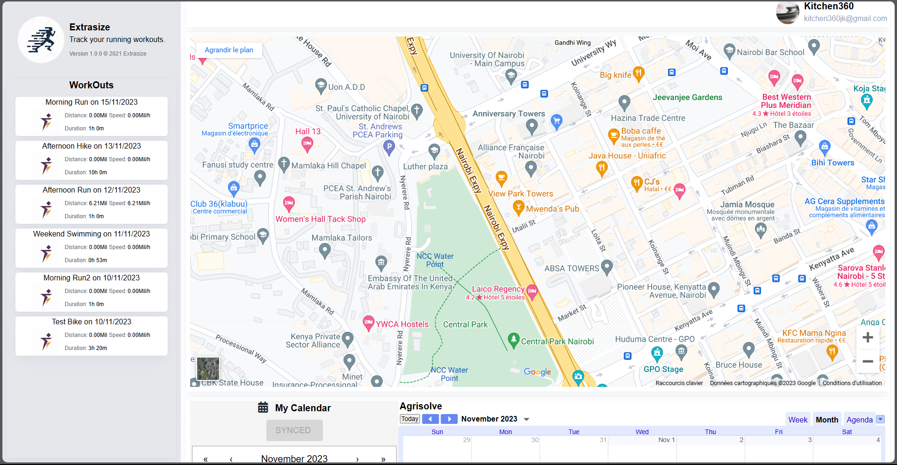
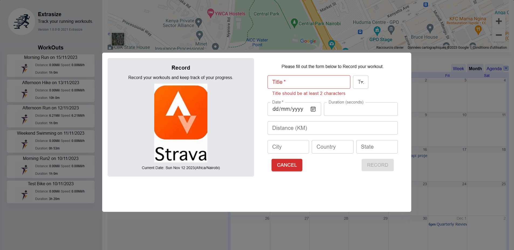

# EXTRASIZE

## Github Repo

https://github.com/Techsupport254/Extrasize

## Register



## Login



## Home






**Cloud Console**
Obtain the client ID and client secret from the Cloud Console plarform and replace the ones in .env file.

**Strava Credentials**
Please read through the strava api documentation to get the required credentials which you'll use in registering an account on the platform.

Steps for Strava API

1. get client id and client secret from strava.com. Log in and view your application. Need to have an app first.

client id =
client secret =

2. get authorization code ==> this is a one time step

https://www.strava.com/oauth/authorize?client_id={your_client_id}&redirect_uri=http://localhost&response_type=code&scope=activity:read_all

auth code =

https://www.strava.com/oauth/authorize?client_id={your_client_id}&redirect_uri=http://localhost&response_type=code&scope=activity:write
auth_code_write =

3. Exchange authorization code for access token & refresh token with read_all ability
   https://www.strava.com/oauth/token?client_id={your_client_id}&client_secret={your_secret_key}&code={code_obtained}&grant_type=authorization_code

4. Exchange authorization code for access token & refresh token with read_all ability
   https://www.strava.com/oauth/token?client_id={your_client_id}&client_secret={your_secret_key}&code={code_obtained}&grant_type=authorization_code

refresh_token =
access_token =
refresh_wite=

4.  https://www.strava.com/api/v3/athlete/activities?access_token={access_token}

**NOTE** Some of the steps requires to be done manually. You can use postman to test the api endpoints.

## Installation

Get the project running locally in your machine by cloning or downloading the project from github.

1. Clone the project from github

```
git clone https://github.com/Techsupport254/Extrasize.git
```

2.  ```
    cd Server
    ```

3.  Install the dependencies

    ```
    npm install
    ```

4.  Run the server

    ```
    npm run dev
    ```

5.  ```
    cd client
    ```

6.  Install the dependencies

    ```
    npm install
    ```

7.  Run the client

    ```
    npm run dev
    ```
